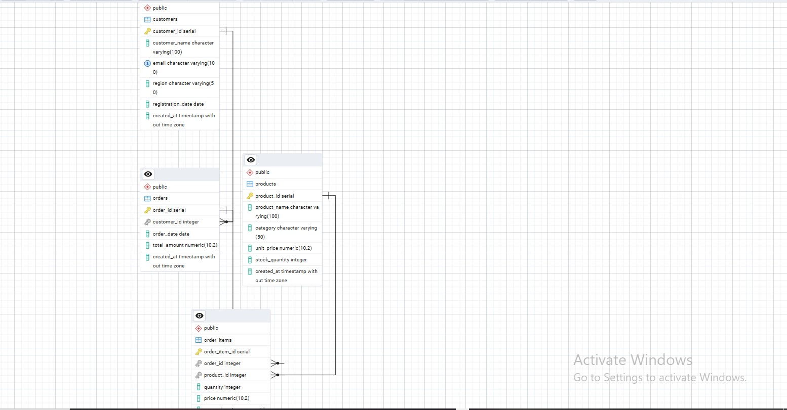
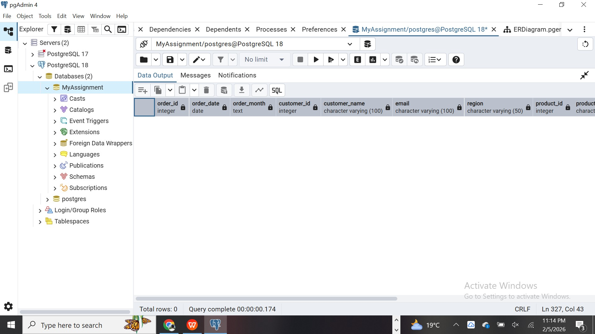

# 🛒 E-Commerce SQL Analytics Project  
### SQL JOINs & Window Functions (PostgreSQL)

📘 **Course:** Database Development with PL/SQL (INSY 8311)  
👨‍🏫 **Instructor:** Eric Maniraguha  
👩‍🎓 **Student:** Tumayine Desire  
🆔 **Student ID:** 26588  
📅 **Submission:** February 2026  
🗄️ **DBMS:** PostgreSQL  

---

## 🚀 Project Objective

This project demonstrates **practical mastery of SQL JOINs and Window Functions** by analyzing a realistic **E-Commerce transactional database**.  
The goal is to transform raw transactional data into **business intelligence insights** that support strategic decision-making.

---

## 🏢 Business Context

This project is designed to provide insights into customer behavior, sales trends, and inventory management through the use of SQL JOINs and Window Functions. The analysis will help in identifying key performance indicators (KPIs) that drive business success.

---

## 📊 Data Sources

The data for this project is sourced from a simulated E-Commerce database, which includes tables for customers, orders, products, and sales transactions.

---

## 🔍 Analysis Techniques

The analysis will utilize various SQL techniques, including:
- INNER JOINs to combine data from multiple tables.
- OUTER JOINs to include all records from one table and matched records from another.
- Window Functions to perform calculations across a set of table rows related to the current row.

---

## 📈 Expected Outcomes

By the end of this project, we expect to deliver a comprehensive report that outlines the findings from the data analysis, along with visualizations that illustrate key trends and insights.

---

## 📅 Timeline

The project is expected to be completed by the end of February 2026.

---

## 📚 References

- SQL Documentation
- PostgreSQL Documentation

---

## 🛠️ Tools Used

- PostgreSQL
- SQL Workbench

---

## 👥 Team Members

- Tumayine Desire

---

## 📞 Contact Information

For any inquiries, please contact me at: tumayine@example.com

---

## ✅ Success Criteria (Window Function Goals)

| # | Analytical Goal | SQL Function |
|--|--|--|
| 1️⃣ | Top 5 products per region | `RANK()`, `DENSE_RANK()` |
| 2️⃣ | Running & cumulative sales totals | `SUM() OVER()` |
| 3️⃣ | Month-over-month growth analysis | `LAG()` |
| 4️⃣ | Customer quartile segmentation | `NTILE(4)` |
| 5️⃣ | 3-month moving averages | `AVG() OVER()` |

---

## 🗄️ Database Schema

### 📁 Tables
- **customers** – customer demographics & region  
- **products** – product catalog & inventory  
- **orders** – customer orders over time  
- **order_items** – detailed line-item transactions  

### 🔗 Relationships
- Customers ⟶ Orders (1-to-Many)  
- Orders ⟶ Order_Items (1-to-Many)  
- Products ⟶ Order_Items (1-to-Many)

📌 **ER Diagram**  
📷

---

## 🔄 Part A — SQL JOINs Implementation

### 🔹 INNER JOIN — Complete Transaction Analysis
**Purpose:** Retrieve all valid transactions with customer and product details  
**Business Insight:** Shows only confirmed, high-integrity sales data

📷 Scr

---

### 🔹 LEFT JOIN — Inactive Customers
**Purpose:** Identify customers who registered but never purchased  
**Business Insight:** Supports re-engagement and activation campaigns

📷 [alt text](02_left_join_result.jpg)

---

### 🔹 RIGHT JOIN — Dead Stock Identification
**Purpose:** Detect products that have never been sold  
**Business Insight:** Highlights inventory at risk and clearance candidates

📷 [alt text](03_right_join_result.jpg)

---

### 🔹 FULL OUTER JOIN — Gap Analysis
**Purpose:** Identify missing or inactive customer-product relationships  
**Business Insight:** Supports strategic planning and data quality checks
[alt text](04_full_outer_join_result.jpg)

---

### 🔹 SELF JOIN — Regional Customer Comparison
**Purpose:** Compare customers within the same region  
**Business Insight:** Enables referral programs and peer benchmarking

---

## 🪟 Part B — Window Functions Implementation

### 🏆 Ranking Functions
**Functions Used:**  
`ROW_NUMBER()`, `RANK()`, `DENSE_RANK()`, `PERCENT_RANK()`

**Use Case:**  
- Top products per region  
- VIP customer identificati!
[alt text](PERCENT_RANK().jpg)on  
!
[alt text](RANK().jpg)

📈 **Insight:** Revenue concentration is driven by a small group of high-value customers and products.

---

### 📈 Aggregate Window Functions
**Functions Used:**  
`SUM()`, `AVG()`, `MIN()`, `MAX()`  
**Frames:** `ROWS`, `RANGE`

**Use Case:**  
- Running revenue totals  
- 3-month moving averages  
- Revenue volatility analysis  

📊 **Insight:** Sales show seasonal patterns with noticeable monthly volatility.

---

### 🔁 Navigation Functions
**Functions Used:**  
`LAG()`, `LEAD()`

**Use Case:**  
- Month-over-month growth  
- Customer purchase intervals  
- Price trend analysis  
[alt text](LEAD().jpg)

📉 **Insight:** Growth fluctuations help detect early warning signs of sales decline.

---

### 🧩 Distribution Functions
**Functions Used:**  
`NTILE(4)`, `CUME_DIST()`

**Use Case:**  
- Customer quartile segmentation  
- Product portfolio (80/20 rule)  
- Regional customer distribution  
 and CUME_DIST().jpg>)

🎯 **Insight:** Top 25% of customers generate a disproportionate share of total revenue.

---

## 📊 Results Analysis

### 🔹 Descriptive — What happened?
Sales are unevenly distributed across regions, customers, and products, with strong concentration among top performers.

### 🔹 Diagnostic — Why did it happen?
Customer purchasing frequency, product pricing, and regional demand patterns drive performance differences.

### 🔹 Prescriptive — What should be done?
- Invest more in **top-quartile customers**
- Promote or discontinue **dead stock**
- Strengthen underperforming regions with targeted campaigns

---

## 🧪 Validation & Testing

✔ All JOIN queries return expected results  
✔ All Window Functions executed successfully  
✔ Data integrity verified across all tables  
 

---

## 🧾 Academic Integrity Statement

> **“All sources were properly cited. Implementations and analysis represent original work.  
> No AI-generated content was copied without attribution or adaptation.”**

---

## ✅ Final Checklist

✔ Public GitHub repository  
✔ Error-free SQL scripts  
✔ Screenshots included  
✔ README professionally documented  
✔ JOINs & Window Functions fully implemented  
✔ Academic integrity maintained  

---

✨ *“Whoever is faithful in very little is also faithful in much.” — Luke 16:10*
